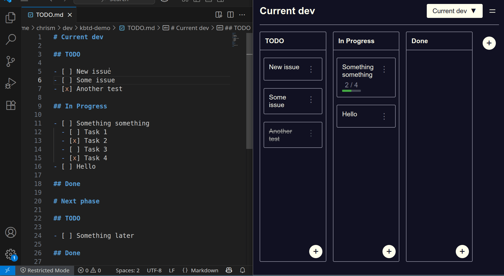

A Kanban board for your Markdown TODO file.

- Drag-and-drop visual editing of plain text Markdown
- Runs 100% in your browser - no server, no database
- Single HTML file - upload to self-host
- CLI tool to launch as a Chrome app: `kbtd TODO.md`
- Two-way binding between UI and text file



## Format

The text based format is designed to be simple for humans, git, and LLMs to read and edit.

```
# Project name

## Column name

- [ ] Task number one.
- [ ] Some other task.

## Another column

- [ ] Yet another task.
```

## Self host

Copy `index.html` up to your server.

If you're using the `kbtd` command line launcher, set `KBTD_URL` to point at your server.
