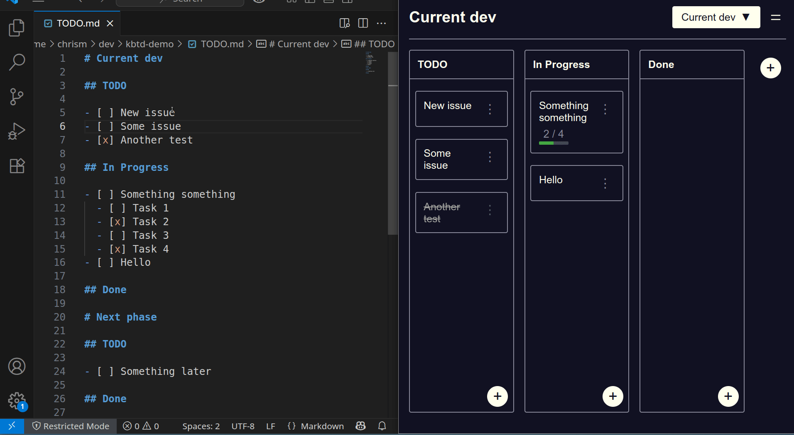

A markdown textfile based kanban board in a single [index.html](./index.html) file.

[Download index.html](https://raw.githubusercontent.com/chr15m/kanban-todo/main/index.html) | [Download Zip](https://github.com/chr15m/kanban-todo/archive/refs/heads/main.zip)

- Drag-and-drop visual editing of plain text Markdown TODOs
- Runs 100% in your browser - no server, no database
- Single HTML file - simply upload to self-host
- CLI tool to launch as a Chrome app: `kbtd TODO.md`
- Two-way binding between UI and text file
- Great for indie-scale solo projects and small teams

[File format](#file-format) | [CLI Install](#cli-install) | [Self Host](#self-host) | [Browser Support](#browser-support) | [Video Walkthrough](#video-walkthrough)



## File Format

The text based format is designed to be simple for humans, git, and LLMs to read and edit.

```
# Project name

## Column name

- [ ] Task number one.
- [ ] Some other task.

## Another column

- [ ] Yet another task.
```

## CLI Install

```
curl -O https://mccormick.cx/apps/kanban-todo/kbtd
chmod 755 kbtd

# By default `kbtd` loads the web app from the my server.
# If self-hosting, set KBTD_URL to load from your server instead:
# export KBTD_URL="https://mccormick.cx/apps/kanban-todo/"

# Then launch with:
./kbtd TODO.md
```

## Self Host

Copy `index.html` up to your server.

If you're using the `kbtd` command line launcher, set `KBTD_URL` to point at your server.

## Browser Support

Unfortunately the web app requires a Chromium-based browser (Chrome, Edge, Brave, etc.) for the [FileSystem Access API](https://developer.mozilla.org/en-US/docs/Web/API/File_System_Access_API). Firefox and Safari don't implement it. The `kbtd` script runs the app in an isolated browser instance that doesn't interfere with your main browser.

## Video walkthrough

[](https://youtu.be/yyBZceJG-Ls)
